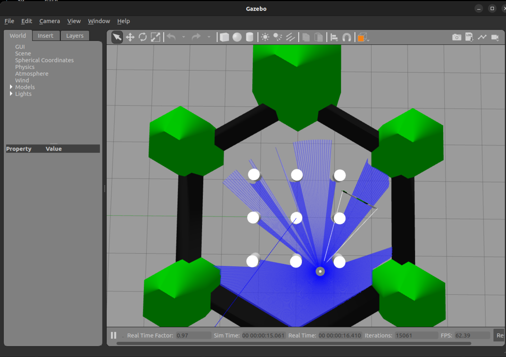
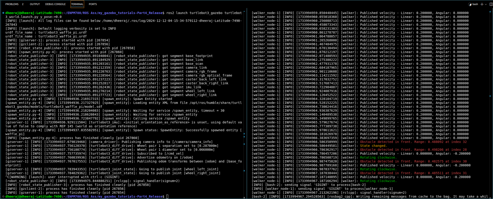

# my_gazebo_tutorials
ENPM700 ROS2 Programming Assignment

The project implements a simple walker algorithm similar to a Roomba robot vacuum cleaner. The robot moves forward until it encounters an obstacle (without colliding), then rotates in place until the path ahead is clear. After that, it moves forward again and repeats the process. Each time the robot rotates, it alternates between rotating clockwise and counterclockwise.

## Directory Structure
```
my_gazebo_tutorials/
├── launch/
│   └── walker.launch.py
├── include/walker/
│   └── walker.hpp
├── src/
│   ├── walker.cpp
├── results/
│   └── bag_list/
│   └── output.png
│   └── term_output.png
│   └── clang-tidy.txt
│   └── cpplint.txt
├── .gitignore
├── README.md
├── LICENSE
├── package.xml
└── CMakeLists.txt
```

### `walker.hpp`

`walker.hpp` is the header file for the walker node. It contains the class definition and member functions declarations for the walker robot's behavior. This file is crucial for defining the interface and functionalities that will be implemented in `walker.cpp`.

Key components of `walker.hpp`:
- Class definition for the walker robot.
- Member variables for storing sensor data and robot state.
- Member functions for processing sensor data and controlling the robot's movements.

This file ensures that the implementation in `walker.cpp` has a clear and organized structure to follow.

### `walker.cpp`

`walker.cpp` is the implementation file for the Walker ROS2 node. It defines the behavior of the robot, including moving forward and avoiding obstacles using a state machine approach. It only considers the input of the lidar scan from a set angle range of 0-40 degrees and confirms an obstacle. The behaviour of the walker robot is decided upon the detection of obstacle as in to move clockwise or anti-clockwise.

## ROS2 Dependencies
Make sure to install the ROS2 Humble version or the appropriate ROS2 distribution on your system and source the ROS2 setup script.
- **rclcpp**: ROS Client Library for C++.
- **std_msgs**: Standard message types for ROS, such as strings and integers.
- Other relevant dependencies (for building ROS2 nodes).

If you are not sure what packages you have or require everything from the start. Run the following command.

```bash
./scripts/install.sh
```

## How to Build and Run

In the root directory of this repository, use the following commands to build the ROS2 package:

```bash
colcon build --packages-select walker
```

### How to run the nodes

After building the package, run the following commands:

`Ensure that the ROS2 environment is properly sourced before running the nodes.(source install/setup.bash[zsh])`

- Terminal 1

  Press `Ctrl+C` after walker node is killed or stopped.
    ```bash
    export GAZEBO_MODEL_PATH=/opt/ros/humble/share/turtlebot3_gazebo/models/
    export TURTLEBOT3_MODEL=waffle_pi
    ros2 launch turtlebot3_gazebo turtlebot3_world.launch.py y_pose:=0.0
    ```

- Terminal 2

  The launch file takes two toggle arguments, `record_bag` and `stop`.
  - `record_bag`: Set True to record ros topics.(Default: `False`)
  - `stop` : Set True to stop the walker node after 30 seconds.(Default: `False`)
    ```bash
    ros2 launch walker walker.launch.py record_bag:=True stop:=True
    ```

## Static Code Analysis with `clang-tidy` and `cpplint`

We use static analysis tools to ensure code quality and consistency.These commands are used for static code analysis.

### `clang-tidy` Command

Run `clang-tidy` with the following command to check for potential issues in the code:

```bash
clang-tidy src/*.cpp > results/clang-tidy.txt
```
**or**
```bash
clang-tidy --extra-arg=-stdlib=libc++ --extra-arg=-I/usr/include/c++/11 --extra-arg=-I/usr/include/x86_64-linux-gnu/c++/11 src/*.cpp > results/clang-tidy.txt
```

- **`-p ./`**: Specifies the location of the `compile_commands.json` file.
- **`--extra-arg=-stdlib=libc++`**: Specifies the standard library to be used for analysis (in this case, `libc++`).
- **`--extra-arg=-I/usr/include/c++/11` and `--extra-arg=-I/usr/include/x86_64-linux-gnu/c++/11`**: Adds the necessary include paths for the C++ standard library and architecture-specific directories.
- **`src/*.cpp`**: Finds all `.cpp` files in the src folder.
- **`test/*.cpp`**: Finds all `.cpp` files in the test folder.

### `cpplint` Command

Run `cpplint` to check the style of the C++ code using this command:

```bash
cpplint --filter=-build/c++11,+build/c++17,-build/namespaces,-build/include_order src/*.cpp >  results/cpplint.txt;
```

- **`cpplint`**: This is the command-line tool for checking C++ code style against Google’s C++ style guide. It flags potential style violations to help maintain consistent code style.

- **`--filter=<rules>`**: The `--filter` flag allows you to include or exclude specific linting rules. Each rule is prefixed with `+` (to include) or `-` (to exclude).

  - **`-build/c++11`**: Excludes rules that enforce C++11 standard practices, allowing more modern C++ standards to be used without warnings.

  - **`+build/c++17`**: Includes rules specific to the C++17 standard, so code is checked against C++17 best practices.

  - **`-build/namespaces`**: Disables checks for namespace style issues, which might be useful if your project has specific namespace conventions.

  - **`-build/include_order`**: Disables checks for include order rules, which can be helpful if your project has a custom include ordering.

- **`src/*.cpp`**: Specifies all `.cpp` files in the `src` directory as the input files for linting.

- **`test/*.cpp`**: Specifies all `.cpp` files in the `test` directory as the input files for linting.

- **`> results/cpplint.txt`**: Redirects the output of the linting results to a file called `cpplint.txt` in the `results` directory. This allows you to review linting feedback later without cluttering the terminal output.

This command runs `cpplint` on all `.cpp` files in the `src` and `test` directory, applies specific filters to customize the linting rules, and saves the output to `results/cpplint.txt`.

## Results
- Sample output of the gazebo simulation



- Terminal Output of the walker launch file




## Additional Notes

- Make sure to have ROS2 dependencies installed and the ROS2 workspace properly set up before building and running the project.
- If you encounter any issues, ensure your system has all required tools (`clang-tidy`, `cpplint`, `colcon`, etc.) installed and that you are working in a properly sourced ROS2 environment.

# License

This project is licensed under the Apache License 2.0. See the [LICENSE](LICENSE) file for details.

The Apache License 2.0 allows you to freely use, modify, and distribute the software, provided that you include a copy of the license and provide proper attribution. It also includes a patent grant, which means that contributors to the project grant you a license to any patents they hold that are necessary to use the software.

For more information about the Apache License 2.0, you can visit the [official Apache License page](https://www.apache.org/licenses/LICENSE-2.0).

## References
[](https://www.theconstruct.ai/read-laserscan-data/)
